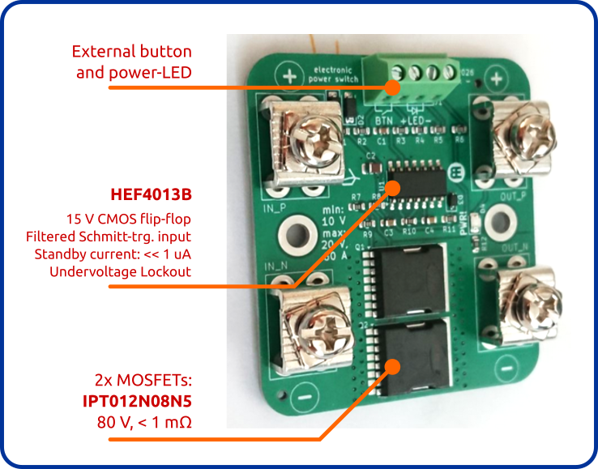

# power_switch
This electronic power switch was originally developed for a robotic buoy to disconnect the battery from the electronics and the motors.

The goal was to replace a large mechanical rotary switch, which wasn't fully waterproof, with a small tactile button behind a silicone membrane for 100 % leak-tightness.
The tactile button is only giving the ON/OFF command and the actual switching is done by a pair of beefy MOSFETs on the PCB.

  * [Schematic](pdf/power_switch.pdf)
  * [Dimensions](pdf/power_switch_outline.pdf)

# License
Copyright 2026 Betz Engineering.

This source describes Open Hardware and is licensed under the CERN Open Hardware Licence Version 2 - Weakly Reciprocal (CERN-OHL-W-2.0).

You may redistribute and modify this source and make products using it under the terms of the CERN-OHL-W-2.0 (spdx.org).

This source is distributed WITHOUT ANY EXPRESS OR IMPLIED WARRANTY, INCLUDING OF MERCHANTABILITY, SATISFACTORY QUALITY AND FITNESS FOR A PARTICULAR PURPOSE. See the CERN-OHL-W-2.0 for conditions of licence.
