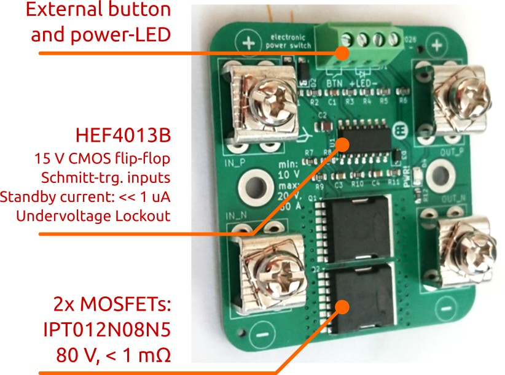

# power_switch
A electronic power switch. Originally developed for a robotic buoy to disconnect the battery from the electronics and the motors.

It was designed to replace a big old mechanical disconnect switch, which had to problem of not being completely waterproof, with a small tactile button only giving the ON/OFF command. The actual switching is handled by a pair of beefy MOSFETs.

  * [Schematic](pdf/power_switch.pdf)
  * [Dimensions](pdf/power_switch_outline.pdf)

